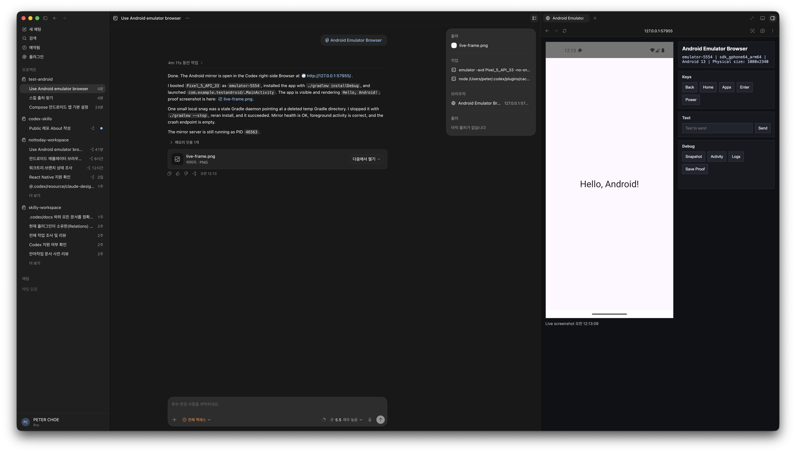

# Build Android Apps

Codex plugin for Android app development workflows.

`build-android-apps` helps Codex mirror, inspect, automate, preview, and debug
adb-connected Android emulators or devices. It is designed for sessions where a
real Android screen, runtime logs, accessibility state, or visual proof needs
to be visible inside Codex.



## Included Skill

| Type | Name | Path | Purpose |
| --- | --- | --- | --- |
| Plugin manifest | `build-android-apps` | `.codex-plugin/plugin.json` | Declares the installable Codex plugin and points Codex at bundled skills. |
| Skill / slash entry | `android-emulator-browser` | `skills/android-emulator-browser/` | Mirrors Android screens into the Codex in-app browser and appears in the Codex slash command list. |
| Skill UI metadata | `Android Emulator Browser` | `skills/android-emulator-browser/agents/openai.yaml` | Provides the Codex app display name, short description, and default `$android-emulator-browser` prompt. |
| Skill instructions | `android-emulator-browser` | `skills/android-emulator-browser/SKILL.md` | Defines when the skill should activate and how Codex should operate safely. |
| Scripts | `android-emulator-browser` | `skills/android-emulator-browser/scripts/` | Node helpers for browser mirroring, Android preview launch, device inspection, screenshots, and proof bundles. |
| Workflow docs | `android-emulator-browser` | `skills/android-emulator-browser/references/` | Supporting workflow notes for Android, previews, proof capture, browser handoff, automation, and debugging. |

## Capabilities

- Mirror an adb-connected Android emulator or device in the Codex in-app
  browser.
- Tap, swipe, type text, send hardware keys, and automate visible UI through
  selector-based endpoints.
- Capture accessibility snapshots through `uiautomator`.
- Inspect foreground activity, focused window, logcat output, and crashes.
- Launch registered React Native, Expo, Jetpack Compose, and Android XML/View
  preview targets.
- Capture structured proof bundles with screenshots, snapshots, logs, and a
  report.

## Install

### First-time install from GitHub

Add the parent repository as a Codex plugin marketplace, then install this
plugin from that marketplace:

```bash
codex plugin marketplace add peterchoee/codex-skills
codex plugin add build-android-apps@codex-skills
```

Open a new Codex session after installing so Codex loads
`android-emulator-browser`.

### Update an existing install

If this plugin is already installed, refresh the GitHub marketplace snapshot
and reinstall the plugin:

```bash
codex plugin marketplace upgrade codex-skills
codex plugin remove build-android-apps@codex-skills
codex plugin add build-android-apps@codex-skills
```

Open a new Codex session after reinstalling. Existing sessions can keep the
previous plugin skill list in memory.

### Verify installation

Check that the plugin is installed, enabled, and using the expected version:

```bash
codex plugin list | rg -C 2 'build-android-apps@codex-skills'
```

The status should show `installed, enabled`. For this repository revision,
`build-android-apps` should install as version `0.1.1` or newer.

You can also verify that a fresh Codex session sees the bundled skill:

```bash
codex -C /path/to/your/android/project debug prompt-input 'Reply OK' \
  | rg 'build-android-apps:android-emulator-browser'
```

### Local development install

For local development from a checked-out copy of the parent repository:

```bash
codex plugin marketplace add /absolute/path/to/codex-skills
codex plugin add build-android-apps@codex-skills
```

For local development, reinstall after plugin changes and then open a new Codex
session. If the local marketplace was already added, run `codex plugin add
build-android-apps@codex-skills` again after changing the plugin.

## Usage

After installation, Codex can trigger the bundled skill when a task involves an
Android emulator, connected device, app preview, runtime debugging, UI
automation, or visual proof collection.

In the Codex app, type `/` and choose `Android Emulator Browser` from the
slash command list. Codex includes enabled skills in that list.

Direct skill invocation:

```text
$android-emulator-browser
```

Example prompts:

```text
Mirror this Android emulator in the Codex browser and help me debug the current screen.
```

```text
Open the Expo preview on my connected Android device and capture proof after the flow works.
```

In debug output or generated skill lists, plugin-installed skills may appear
with their plugin namespace:

```text
build-android-apps:android-emulator-browser
```

## Requirements

- Android SDK platform tools with `adb` available.
- At least one connected Android emulator or device for live mirroring.
- Node.js for the bundled helper scripts.
- A project-specific build/install command when the target app is not already
  installed.

## Main Scripts

Start an Android browser mirror:

```bash
node skills/android-emulator-browser/scripts/serve-android-emulator.mjs \
  --serial <serial> \
  --package <package.name>
```

Launch a registered Android preview target:

```bash
node skills/android-emulator-browser/scripts/android-preview-browser.mjs \
  /absolute/path/to/project \
  --target <preview-target> \
  --device <serial>
```

## Safety Model

The bundled skill is adb-first and portable. It does not require root access,
`scrcpy`, global adb resets, or project source edits unless the user explicitly
asks for that kind of change.

When more than one device is connected, Codex should choose an explicit serial
before sending input. It should not wipe data, delete an AVD, stop unrelated
emulators, or claim success from a local URL alone. Visual QA and debug
reproduction should be backed by captured screenshots, snapshots, logs, or a
proof bundle.
